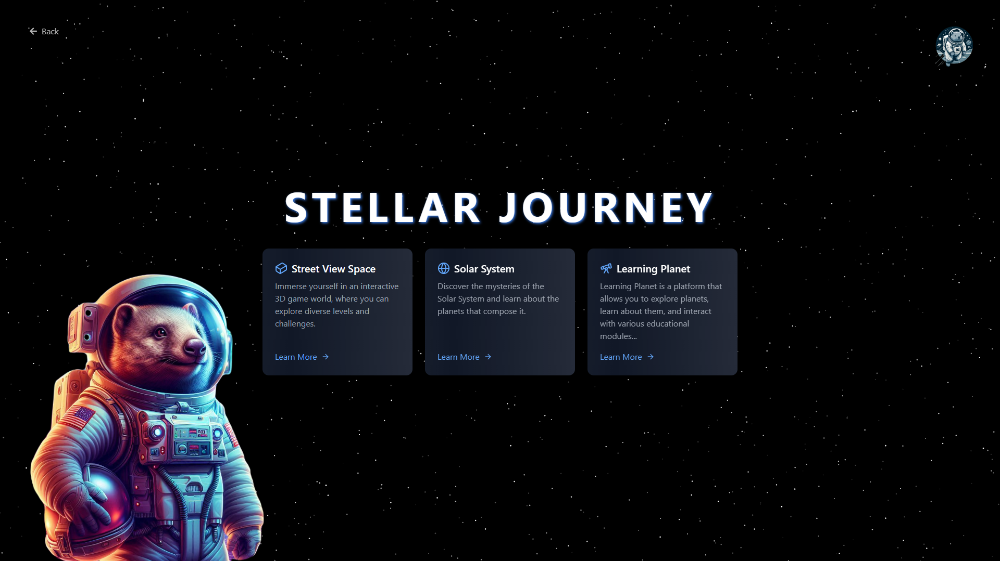
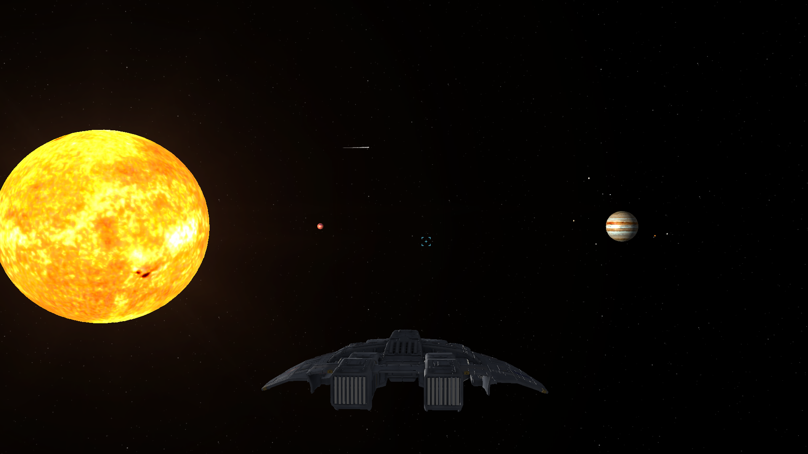
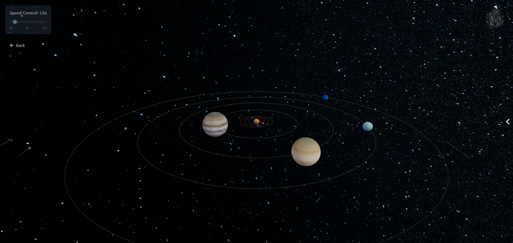
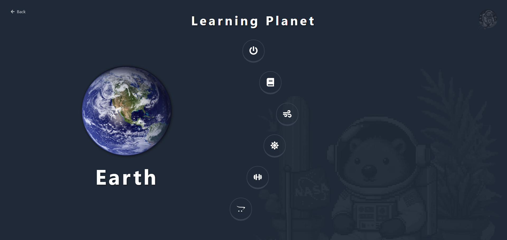

<div align="center">
  
  
  # STELLAR JOURNEY
  <br/>
</div>


### 🚀 An Interactive Educational App for Exploring Astronomy 🌌

**STELLAR JOURNEY** is a fun and engaging educational app designed specifically for children and teenagers. It combines learning with entertainment, making astronomy more accessible and enjoyable for young learners. Through immersive virtual space travel, users can explore the wonders of the cosmos in a way that inspires curiosity and a sense of adventure.

---

<br/>

<div align="center">
  
</div>
<br/>


<p align="center">
  
  
    
</p>

<br/>

## Features

- **Virtual Space Travel:** <br/> Embark on a journey through space using a virtual rocket, similar to Street View, allowing users to zoom in on planets, stars, and celestial objects.
  
- **Solar System Exploration:** <br/> Learn in-depth details about the Solar System, including the planets, their moons, and the Sun's processes.

- **Interactive Quizzes:** <br/> Reinforce learning with engaging quizzes that make complex astronomical topics easier to understand.

- **Fun & Educational:** <br/> The app is designed to be both entertaining and educational, making science and STEM subjects more approachable for young minds.

---

<br/>

## Purpose

STELLAR JOURNEY was created to address the challenge of making science education, particularly astronomy, engaging and interactive for children and teenagers. By integrating play-based learning with STEM education, this app helps inspire early interest in space science.

---

<br/>

## Why STELLAR JOURNEY Matters

- **Curiosity & Exploration:** The app encourages users to explore the vastness of the universe, fostering a sense of curiosity.
  
- **STEM Education:** By making complex scientific concepts more approachable, STELLAR JOURNEY promotes early education in STEM (Science, Technology, Engineering, Mathematics).

- **Interactive Learning:** The mix of fun, play, and quizzes makes learning about space an exciting experience, crucial for building future scientific interest.

---

<br/>

## Technologies Used

-  - Fast and modern build tool for web projects.
-  - JavaScript library for building user interfaces.
-  - Strongly typed programming language that builds on JavaScript.
-  - JavaScript 3D library for rendering 3D graphics in the browser.

---

<br/>

## Installation & Setup

1. Clone the repository:
   ```bash
   git clone https://github.com/Dawidsjd/NASA_SpaceApps2024.git

2. Navigate to the project directory:
   ```bash
   cd galaxyWombat

3. Install dependencies:
   ```bash
   npm install

4. Run the app:
   ```bash
   npm run dev
<div align="center">
  
</div>
